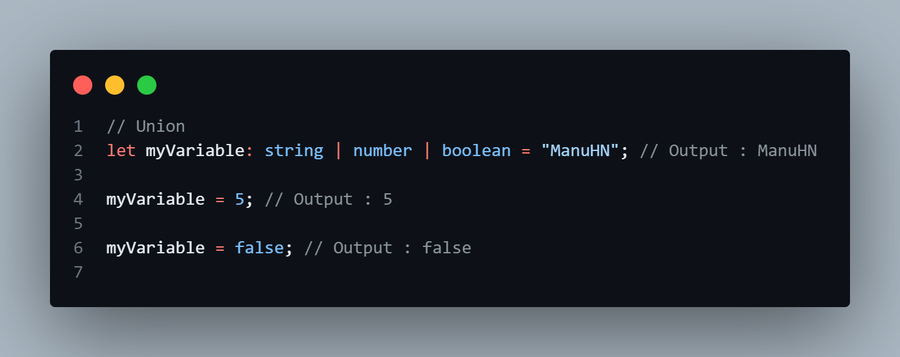
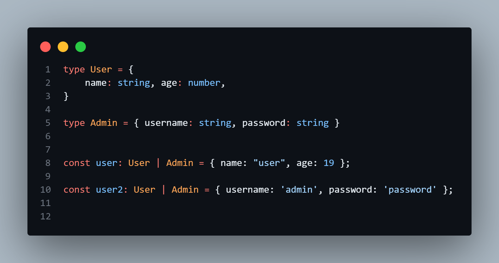
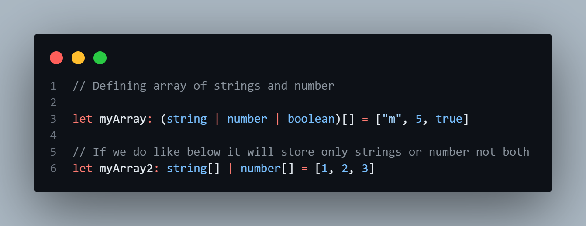

# Typescript

##### What is Typescript

TypeScript is a programming language that's very similar to JavaScript, but with an extra layer of rules and guidelines. It helps developers catch mistakes early on by checking for errors while they're writing their code. Think of it like having a helpful assistant who makes sure everything in your code fits together correctly before you run it.

- Install Typescript Compiler
  -- `npm install -g typescript`

- To run the typescript compiler on a file:
  `tsc filename.ts`

##### Syntax for declaring variable

1. Variable Declaration

`let variableName : type = value`

- `let / const` : Anything you wish to declare
- `variableName`: The name of the variable. It can contain letters, digits and underscores. However, it cannot start with
- `type` : The type of the variable. Like string, number, boolean etc.
- `value` : The value of the variable. Can be any valid javascript expression. but needs to follow the type rules.

2. function declaration

- with parameter and no return type
  syntax :
- function functionName( variableName : type ){ }
- 

- with parameter and with return type
- syntax :
- function functionName( variableName : type ) : returnType { return returnType }
- 

- Arrow Function
- 

- Object as return type
  

#### Types

- number : It is for numbers both integers and float values
- string : for string values
- boolean : for true or false
- Arrays : to store values in an array
  we can declare them like `number[]` for array of numbers or `string[]` for array of strings.

- any : Use `any` when no need to check for specific types and to avoid type errors.
- noImplicitAny : To avoid use of any, because `any` is not type-checked by compiler, we should flag noImplicitAny to flag any implicit any as an error.

* Note : Every type must be declared in lowercase

### Type Aliases

#### `type` keyword

- While working with object we can annotate the types directly but we can also make them refer a single name instead of writing annotation every type
- here we use `type` keyword

-

### Arrays

- defining array
- `const arrayName : type [] = arrayValue`

- 

- `const arrayName : Array<type> = arrayValue` ~ Generics

- 

- `const arrayName : number[][] = [ [ 1, 2, 3], [4, 5, 6]]`

- 

### Union

- `union` (`|`) is way to declare a type that can hold different types of values.

- usage of union

1. ;
    
    

2. ;
    
    
3. ;

### Tuples

- In TypeScript, tuples are a data structure that allow you to store a fixed number of elements of different types in a specific order.

* Fixed Size: Unlike arrays where you can add or remove elements freely, tuples have a fixed size. Once defined, you can't change the number of elements in a tuple.

* Ordered Elements: Each element in a tuple has a specific position or index, just like in arrays. This means you can access elements by their index number.

* Different Types: Unlike arrays where all elements typically have the same type, each element in a tuple can have a different type. For example, the first element can be a number, the second a string, and so on.
